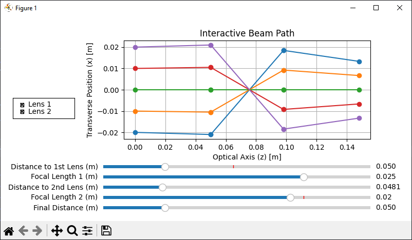

# Beam Path Simulator

A simple interactive beam path simulation tool using matrix optics. 
This tool allows users to visualize how a beam propagates through an 
optical system with configurable distances and lens focal lengths.

## Screenshot
Here is a screenshot of the program in action:



## Features
- Interactive sliders to adjust optical parameters
- Checkbox controls to enable/disable lenses
- Real-time beam path updates
- Uses matrix optics for accurate ray tracing

## Installation

Clone the repository and install dependencies:

```bash
git clone https://github.com/EikeHanel/beam_path_sim
cd beam_path_sim
pip install -r requirements.txt
```

## Dependencies
This project requires the following Python libraries:

```
numpy
matplotlib
```

## Usage
Run the script to launch the interactive beam path simulator:

```bash
python main.py
```

Adjust the sliders and checkboxes to see how different parameters affect 
the beam propagation.

## File Structure
- `main.py` - Main script containing the simulation logic
- `requirements.txt` - List of required dependencies
- `README.md` - Project documentation

## How It Works
The script uses ray transfer matrices to simulate the propagation of a 
light beam through an optical system consisting of free space and thin lenses. 
The beam's path is updated interactively based on user input.

## Contributing
Feel free to submit issues or pull requests to improve the project!

## License
This project is licensed under the MIT License.

